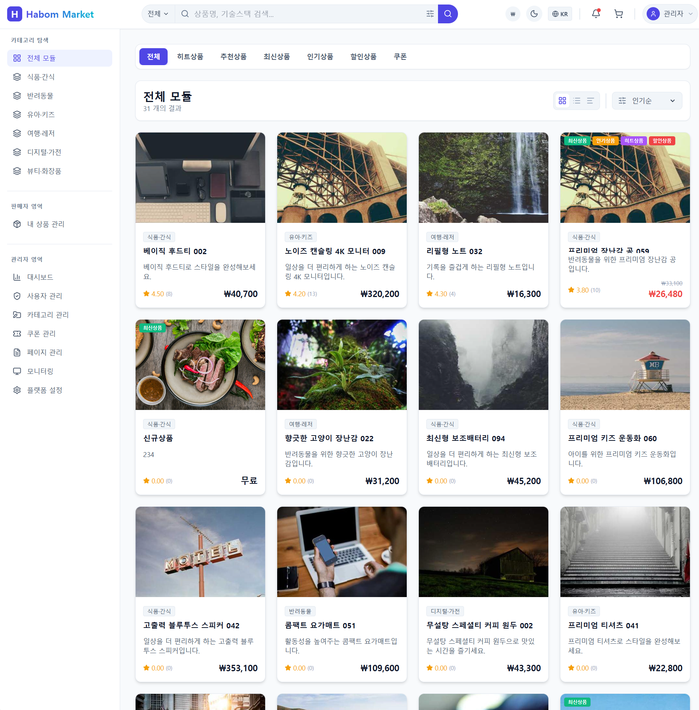

# kmelon-market

# 🌱 kmelonLab — AI-based Developer Tools & Productivity Services

Independent developer building AI-powered productivity tools and community-driven utilities.  
Public Docker releases are available, and sponsors can access early alpha/beta builds and priority feature requests.

AI 기반 생산성 도구 및 개발자 커뮤니티 중심 유틸리티 서비스를 개발하고 있습니다.  
Docker 기반 애플리케이션을 공개 배포하며, 스폰서에게는 알파/베타 버전과 기능 요청 우선권을 제공합니다.

---

### 💖 Support Development / 개발 후원하기

[👉 Become a Sponsor](https://github.com/sponsors/kmelonLab)

Your support helps sustain development, pay server costs, and deliver continuous improvements.  
여러분의 후원은 서버 비용과 지속적인 개발에 큰 힘이 됩니다.

---

## 🎬 Promo Video (홍보 영상)

<!-- 썸네일 이미지를 클릭하면 YouTube로 이동합니다 -->

📺 Click the image above to watch the video 
📺 위 이미지를 클릭하면 영상을 볼 수 있습니다

---

## 🚀 Features (주요 기능)

### 🌐 Public Features (공개 기능)
- Public Docker image releases (`latest` version)
- Easy deployment for personal/production environments
- Ready-to-use developer utility services (e.g., automation, processing, scheduling)
- Continuous updates and improvements based on feedback

- 최신 버전 Docker 이미지 공개 제공
- 개인/프로덕션 환경에서 손쉬운 배포
- 개발자 생산성을 높이는 유틸리티 서비스 제공 (자동화, 처리, 스케줄링 등)
- 사용자 피드백 기반 지속적 개선

### ⭐ Sponsor-exclusive Features (후원 전용 기능)
- Early access to `alpha` / `beta` builds before public releases
- Priority feature requests & roadmap influence
- Private discussion & development update previews

- 알파/베타 빌드 사전 접근 권한
- 기능 요청 우선 처리 및 로드맵 반영
- 개발 진행 상황 미리보기 및 비공개 논의 참여

---

## 🧠 Vision & Goals (비전 및 목표)

### 🎯 Vision
Build useful tools that empower individual developers and enable creativity, productivity, and learning.

개발자들이 더 효율적으로 만들고, 배우고, 성장할 수 있는 도구를 제공하는 것이 목표입니다.

### 📈 Goals
- Release practical tools that help real developers
- Expand Docker-based services and modular tools
- Grow a global developer community
- Improve quality through real-world feedback and sponsor collaboration

- 실제로 도움이 되는 개발 도구 제공
- Docker 기반 서비스 확장 및 모듈화
- 글로벌 개발자 커뮤니티 성장
- 후원자 의견과 실제 사용 피드백 기반 개선

---

## 📦 Docker Images (도커 이미지 배포)

| Release type | Access |
|--------------|--------|
| `latest` | Public |
| `alpha` / `beta` builds | Sponsor only |
| Feature requests | Sponsor priority |

🔧 Easy integration guides & examples coming soon.
🛠 사용 가이드 및 예제는 곧 제공될 예정입니다.

---

## 🔗 Live Service / Demo (서비스 링크)

| Type | URL | Note |
|------|-----|------|
| 🌐 Production | https://market.habom.kr | Live Service  |
| 🧪 Demo | https://market-demo.gpt.io.kr | ID: `demo@demo.com` / PW: `demo1234` |

> 💳 **Live Service Notice**: The production service processes real payments. Please be careful when making purchases.

> 💳 **운영 서비스 안내**: 운영 서비스는 실제 결제가 진행됩니다. 구매 시 유의해 주세요.

> ⚠️ **Demo Notice**: The demo account has admin privileges. If data is deleted or the service is disrupted for other users, the demo will be suspended immediately.

> ⚠️ **데모 안내**: 데모 계정은 관리자 권한으로 접속됩니다. 내부 데이터 삭제 또는 다른 사용자의 이용을 방해하는 경우, 데모 서비스는 즉시 중단됩니다.

---

## 📢 Social / Contact

| Platform | Link |
|----------|------|
| GitHub | https://github.com/kmelonLab |
| Docker Hub | https://hub.docker.com/u/habom |
| Email | kmelon.zero@gmail.com |
| X(Twitter) | https://x.com/habom_IT | *(예: 후원자 감사 메시지 게시 가능)*  
| Youtube | https://www.youtube.com/@habomIT |
| KakaoTalk | https://open.kakao.com/o/gCG7vvZh |
| Habom Community | https://hub.habom.kr |

Feel free to reach out anytime!  
언제든 편하게 연락주세요!

---

## 💝 Acknowledgements (감사의 말)

Thank you to everyone supporting this project.  
Your support enables continuous releases and helps build tools that benefit the whole community.

이 프로젝트를 응원해주시는 모든 분들께 감사드립니다.  
여러분의 후원 덕분에 지속적인 업데이트와 더 좋은 개발 도구를 만들어갈 수 있습니다.

---

## 📄 License

Docker images are publicly available, while the source code is currently private for controlled development and quality assurance. Redistribution or modification of the code is not permitted. Sponsors can contribute feedback and influence development direction.

Docker 이미지는 누구나 사용할 수 있도록 공개되어 있으며,
소스 코드는 개발 안정성과 품질 관리를 위해 비공개로 유지되고 있습니다.
코드의 재배포 또는 수정은 허용되지 않습니다.
스폰서는 프로젝트 방향성에 의견을 제시할 수 있습니다.

---

### 💖 Support the Project

[👉 Become a Sponsor](https://github.com/sponsors/kmelonLab)

Thank you for your support!  
후원해주셔서 감사합니다! 🙏

